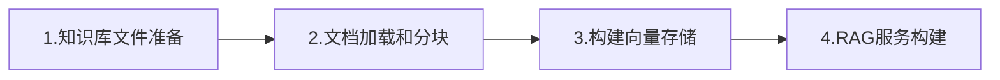

## 1.前置环境准备

### 1.1 环境要求

- JDK 17+
- **Maven** 或 Gradle（推荐 Spring Boot 3.x）
- 一个可用（含有Embedding嵌入模型额度）的 LLM API（如 OpenAI、Ollama、Azure OpenAI、DeepSeek、通义千问、**智谱**等）
- 向量数据库（如 Chroma、Pinecone、Milvus、**Pgvector**或 Spring AI 内置的 SimpleVectorStore）
- docker 环境（部署向量数据库，可选）

### 1.2 添加依赖

```xml
    <parent>
        <groupId>org.springframework.boot</groupId>
        <artifactId>spring-boot-starter-parent</artifactId>
        <version>3.2.3</version>
    </parent>

    <properties>
        <maven.compiler.source>17</maven.compiler.source>
        <maven.compiler.target>17</maven.compiler.target>
        <project.build.sourceEncoding>UTF-8</project.build.sourceEncoding>
        <spring-boot.version>3.2.3</spring-boot.version>
        <spring-ai.version>1.0.3</spring-ai.version>
    </properties>

    <dependencyManagement>
        <dependencies>
            <dependency>
                <groupId>org.springframework.ai</groupId>
                <artifactId>spring-ai-bom</artifactId>
                <version>1.0.3</version>
                <type>pom</type>
                <scope>import</scope>
            </dependency>
        </dependencies>
    </dependencyManagement>

    <dependencies>
        <!-- Web 支持 -->
        <dependency>
            <groupId>org.springframework.boot</groupId>
            <artifactId>spring-boot-starter-web</artifactId>
        </dependency>

<!--  向量数据库   -->
        <dependency>
            <groupId>org.springframework.ai</groupId>
            <artifactId>spring-ai-starter-vector-store-pgvector</artifactId>
        </dependency>
<!-- 智谱llm-->
        <dependency>
            <groupId>org.springframework.ai</groupId>
            <artifactId>spring-ai-starter-model-zhipuai</artifactId>
        </dependency>
<!--    postgresql  -->
        <dependency>
            <groupId>org.postgresql</groupId>
            <artifactId>postgresql</artifactId>
        </dependency>
        <dependency>
            <groupId>org.projectlombok</groupId>
            <artifactId>lombok</artifactId>
            <scope>provided</scope>
        </dependency>
        
    </dependencies>


    <repositories>
        <repository>
            <id>spring-snapshots</id>
            <name>Spring Snapshots</name>
            <url>https://repo.spring.io/snapshot</url>
            <releases>
                <enabled>false</enabled>
            </releases>
        </repository>
        <repository>
            <name>Central Portal Snapshots</name>
            <id>central-portal-snapshots</id>
            <url>https://central.sonatype.com/repository/maven-snapshots/</url>
            <releases>
                <enabled>false</enabled>
            </releases>
            <snapshots>
                <enabled>true</enabled>
            </snapshots>
        </repository>
    </repositories>
```

### 1.3 向量数据库`pgvector`

`docker-compose.yml`

```yml
version: '3.8'

#  docker pull swr.cn-north-4.myhuaweicloud.com/ddn-k8s/docker.io/pgvector/pgvector:pg17-linuxarm64
#  docker tag  swr.cn-north-4.myhuaweicloud.com/ddn-k8s/docker.io/pgvector/pgvector:pg17-linuxarm64  docker.io/pgvector/pgvector:pg17

services:
  pgvector:
    image: pgvector/pgvector:pg17
    container_name: pgvector-db
    restart: unless-stopped
    environment:
      POSTGRES_DB: aidb          # 默认数据库名
      POSTGRES_USER: aidb      # 应用用户（非超级用户）
      POSTGRES_PASSWORD: admin  # 请务必修改！
      POSTGRES_INITDB_ARGS: "--auth-host=scram-sha-256"
    ports:
      - "5432:5432"                  # 映射到宿主机 5432
    volumes:
      - pgvector_data:/var/lib/postgresql/data
      # 可选：挂载自定义初始化脚本
      # - ./init-scripts:/docker-entrypoint-initdb.d
    healthcheck:
      test: ["CMD-SHELL", "pg_isready -U aidb -d aidb"]
      interval: 30s
      timeout: 10s
      retries: 3

volumes:
  pgvector_data:
```

## 2. 流程总览



## 3. 系统构建

### 3.1 知识文档准备

这里准备两个文本文件（文件内容可以不做限制，方便理解和处理,不同格式文件处理方式也不同）`company_policy.txt`、`product_guide.txt`，放在`resource/documents`下。

```txt
公司实行弹性工作制，核心工作时间为10:00-16:00。
员工每年享有15天带薪年假。
加班需提前申请并获得主管批准。
```

```txt
我们的主打产品是 Spring AI 助手，支持 RAG、Agent 和对话记忆。
支持 OpenAI、Ollama、Azure 等多种模型后端。
```

### 3.2 项目配置

`application.yml`

```yml
server:
  port: 8090

spring:
  datasource:
    url: jdbc:postgresql://localhost:5432/aidb
    username: aidb
    password: admin
    driver-class-name: org.postgresql.Driver
  ai:
    zhipuai:
      api-key: apikey
#      base-url: https://open.bigmodel.cn/api/paas/v4
      chat:
          options:
              model: glm-4.5-flash
      embedding:
        options:
          model: embedding-3
          dimensions: 1024


    vectorstore:
      pgvector:
        table-name: ai_vector 
        initialize-schema: true
        dimensions: 1024


```

> [!NOTE] 
>
> * 新版`zhipu api`在使用`embedding`可以不用配置`base-url`，否则会出现404
> * 向量数据库数据维度`dimensions`需要和`embedding.model.dimensions`保持一致 ，不一致需要删表重建
> * 注意申请Api需要有对应模型的请求额度
> * docker部署的向量数据库更加便捷，不会出现本地部署或者连接云端数据库缺少扩展的问题

### 3.3 文件处理

#### 3.3.1 文件加载

```java
Resource resource = new DefaultResourceLoader().getResource("classpath:documents/company_policy.txt");
List<Document> documents = new TextReader(resource).get();
```

#### 3.3.2 文件分块

使用`TokenTextSplitter`分块

```java
var textSplitter = new TokenTextSplitter();
List<Document> chunks = textSplitter.apply(documents);
```

#### 3.3.3 文件向量化存储

调用`Embedding`模型向量化，并进行存储

```java
vectorStore.add(chunks);
```


#### 3.3.4 整体流程

> 这里是设置项目启动处理文件，进行分块和向量化，但这里做了去重处理，防止重复向量化。（第一次启动后续可以注释掉。）

```java
@Component
public class DocumentLoader {

    private static final Logger log = LoggerFactory.getLogger(DocumentLoader.class);
    private final VectorStore vectorStore;

    public DocumentLoader(VectorStore vectorStore) {
        this.vectorStore = vectorStore;
    }

    @EventListener(ApplicationReadyEvent.class)
    public void loadDocuments() throws IOException {

        //1.查询向量库,避免调用请求重复向量化
        List<String> vecStores = queryVecStore();
        //2.加载文档
        PathMatchingResourcePatternResolver resolver = new PathMatchingResourcePatternResolver();
        Resource[] resources = resolver.getResources("classpath:documents/*.txt");
        for (Resource resource : resources) {
            log.info("Loading document: {}", resource.getFilename());
            List<Document> documents = new TextReader(resource).get();

            documents.forEach(doc -> {
                String fileName = (String) doc.getMetadata().get("source");
                System.out.println("✅ 文件: " + fileName);
                System.out.println("📝 内容预览: " + doc.getText().substring(0, Math.min(100, doc.getText().length())));
            });

            String source = (String) documents.get(0).getMetadata().get("source");
            if (vecStores.contains(source)){
                log.info("✅ {}已加载，跳过",source);
                continue;
            }
            //3.将文档分割成小块
            var textSplitter = new TokenTextSplitter();
            List<Document> chunks = textSplitter.apply(documents);
            //4.触发嵌入模型对每个文本块进行向量化
            vectorStore.add(chunks);
            log.info("✅ 已加载 {} 个文档块到向量库", chunks.size());
        }


    }

    private List<String> queryVecStore() {
        List<Document> docs = vectorStore.similaritySearch(SearchRequest.builder().query("demo").topK(100).build());
        List<String> fileNames = new ArrayList<>();
        if (!docs.isEmpty()) {
            docs.forEach(doc -> {
                String fileName = (String) doc.getMetadata().get("source");
                fileNames.add(fileName);
                System.out.println("✅ 已查询到文件: " + fileName);
            });
        }
        return fileNames;
    }


}
```

### 3.4 构建RAG服务

```java
@Service
@Slf4j
public class RagService {

    private final VectorStore vectorStore;
    private final ChatClient chatClient;

    public RagService(VectorStore vectorStore, ChatClient.Builder chatClientBuilder) {
        this.vectorStore = vectorStore;
        this.chatClient = chatClientBuilder.build();
    }

    public String ask(String question) {

        List<Document> docs = vectorStore.similaritySearch(SearchRequest.builder().query(question).topK(3).build());

        // 👇 打印检索结果（关键！）
        log.info("检索到 {} 个文档", docs.size());
        for (int i = 0; i < docs.size(); i++) {
            log.info("文档 {}: {}", i, docs.get(i).getMetadata().get("source"));
        }

        String context = docs.stream()
                .map(Document::getText)
                .collect(Collectors.joining("\n---\n"));

        String prompt = """
                你是一个公司内部助手，请严格基于以下上下文回答问题。
                如果上下文没有相关信息，请回答：“我不知道”。

                上下文：
                %s

                %s
                """.formatted(context, question);

        return chatClient.prompt(prompt).call().content();
    }
}
```

## 4. 测试

```java
@RestController
@RequestMapping("/api/rag")
public class RagController {

    private final RagService ragService;

    public RagController(RagService ragService) {
        this.ragService = ragService;
    }

    @PostMapping("/ask")
    public String ask(@RequestBody String question) {
        return ragService.ask(question);
    }
}
```

https://docs.apipost.net/docs/detail/54a3c7c42c51000?target_id=a14d362f47105&locale=zh-cn

 

## 5.存在的问题

在使用 Spring AI 进行文件分块（chunking）时，虽然框架提供了如 `RecursiveCharacterTextSplitter` 等基础工具，但在实际应用中仍存在多个常见问题。以下是**典型问题 + 优化建议**，帮助你构建更可靠、高效的 RAG 系统。

------

### 🔍 一、常见问题与优化方案

#### 1️⃣ **分块大小不合理 → 语义断裂或信息冗余**

- **表现**：

  - chunk 太小（如 50 tokens）：关键信息被切断（如“公司成立于” + “2010年” 分在两块）
  - chunk 太大（如 2000 tokens）：无关信息混入，降低检索精度，且可能超出 LLM 上下文窗口

- ✅ **优化建议**：

  ```java
  // 推荐配置（适用于大多数中文场景）
  var splitter = new RecursiveCharacterTextSplitter(
      RecursiveCharacterTextSplitterOptions.builder()
          .withChunkSize(300)    // 中文约 300 字 ≈ 400~500 tokens
          .withChunkOverlap(50)  // 保留上下文衔接
          .build()
  );
  ```

  - **动态调整**：根据文档类型调整（合同用大块，FAQ 用小块）
  - **按语义分块**：优先按段落、标题、列表等自然边界切分

------

#### 2️⃣ **忽略文档结构 → 表格/代码/标题丢失**

- **表现**：

  - PDF 或 Markdown 中的表格、代码块被强行打断
  - 标题与正文分离，导致 chunk 缺少上下文（如“第3章 安全规范” 和 “所有操作需双人复核” 不在同一块）

- ✅ **优化建议**：

  - **预处理保留结构**：

    ```java
    ## 用户权限管理
    - 普通用户：只能查看自己数据
    - 管理员：可分配角色
    ```

    → 分块时确保整个列表在一个 chunk 中

  - **使用高级分块策略**（未来可集成）：

    - 基于 NLP 的句子边界检测（如 spaCy）
    - 基于 Markdown/HTML 结构的智能分块（如 LangChain 的 `MarkdownHeaderTextSplitter`）

> 📌 Spring AI 目前不直接支持结构感知分块，需自行扩展 `TextSplitter`。

------

#### 3️⃣ **元数据丢失 → 无法追溯来源**

- **表现**：

  - 检索到答案后，不知道来自哪个文件、哪一页
  - 无法在回答中引用来源（如“根据《产品手册》第5页...”）

- ✅ **优化建议**：

  ```Java
  List<Document> chunks = splitter.apply(documents);
  
  // 为每个 chunk 添加来源信息
  for (Document chunk : chunks) {
      chunk.getMetadata().put("source", chunk.getMetadata().get("file_name"));
      chunk.getMetadata().put("chunk_index", "自增ID或哈希");
  }
  ```

  - 在最终回答中可拼接来源（需修改 prompt）：

    ```
    回答：公司成立于2010年。
    来源：company_policy.txt
    ```

------

#### 4️⃣ **重复内容或噪声干扰**

- **表现**：

  - 文件包含页眉/页脚/水印（如“机密 - 第 1 页”）
  - 多个文件内容高度重复（如不同版本的政策文档）

- ✅ **优化建议**：

  - **预清洗文本**：

    ```java
    String cleanText = rawText
        .replaceAll("机密.*?页", "")
        .replaceAll("\\s+", " ") // 合并空白
        .trim();
    ```

  - **去重**：对 chunk 内容做 MinHash 或 SimHash 去重（适合大规模知识库）

------

#### 5️⃣ **编码/格式错误导致乱码或空内容**

- **表现**：

  - Windows 保存的 UTF-8 with BOM 文件 → 开头出现 ``
  - GBK 编码文件被当 UTF-8 读 → 中文乱码

- ✅ **优化建议**：

  - 统一要求文档为 **UTF-8 无 BOM**

  - 使用 `Charset` 显式指定（Spring AI 的 `TextReader` 默认用系统编码）：

    ```Java
    // 可继承 TextReader 并重写 read 方法指定 charset
    ```

------

#### 6️⃣ **不分文档类型统一处理 → 效果差**

- **表现**：

  - 把技术手册和员工守则用相同 chunk size 处理
  - PDF 扫描件（图片）被当作文本处理 → 内容为空

- ✅ **优化建议**：

  - **按类型路由分块策略**：

    ```java
    if (fileName.endsWith("manual.pdf")) {
        useChunkSize(500);
    } else if (fileName.endsWith("faq.txt")) {
        useChunkSize(150);
    }
    ```

  - **过滤无效文档**：跳过空文件、加密 PDF、纯图片 PDF

------

### 🚀 高级优化方向（进阶）

| 方向                                  | 说明                                                         |
| ------------------------------------- | ------------------------------------------------------------ |
| **语义分块（Semantic Chunking）**     | 用 embedding 计算句子间相似度，在语义边界切分（比字符分块更优） |
| **父子分块（Parent-Child Chunking）** | 小 chunk 用于检索，大 chunk（父）用于生成答案，兼顾精度与上下文 |
| **混合检索**                          | 结合关键词（BM25）+ 向量检索，提升召回率                     |
| **缓存分块结果**                      | 避免每次启动都重新分块，可序列化 chunks 到磁盘               |

> 💡 Spring AI 目前未内置这些高级功能，但可通过自定义 `TextSplitter` 或结合其他库（如 LangChain4j）实现。

------

### ✅ 最佳实践总结

1. **分块大小**：中文推荐 `chunkSize=250~400`，`overlap=50`
2. **保留元数据**：记录 `file_name`、`page_number`（PDF）、`chunk_id`
3. **预处理清洗**：去除噪声、统一编码、修复换行
4. **验证分块效果**：启动时打印几个 chunk 示例，人工检查是否合理
5. **监控检索质量**：记录 top-1 chunk 是否包含答案（可用于评估）

------

### 🧪 示例：带来源的分块 + 清洗

```java
@Bean
public VectorStore vectorStore(EmbeddingClient embeddingClient) throws Exception {
    Resource[] resources = new PathMatchingResourcePatternResolver()
        .getResources("classpath:documents/*.txt");

    List<Document> allChunks = new ArrayList<>();
    int chunkId = 0;

    for (Resource res : resources) {
        String filename = res.getFilename();
        String content = StreamUtils.copyToString(res.getInputStream(), StandardCharsets.UTF_8);
        
        // 清洗
        content = content.replaceAll("内部资料.*?页", "").trim();
        
        Document doc = new Document(content, Map.of("file_name", filename));
        List<Document> chunks = new RecursiveCharacterTextSplitter(300, 50).apply(List.of(doc));
        
        for (Document chunk : chunks) {
            chunk.getMetadata().put("chunk_id", "chunk_" + (++chunkId));
            allChunks.add(chunk);
        }
    }

    var store = new SimpleVectorStore(embeddingClient);
    store.add(allChunks);
    return store;
}
```

## 开源处理方案

**值得推荐的开源处理方案**，按适用场景分类：

------

### ✅ 1. LlamaIndex（Python） + Spring AI 混合架构（推荐）

> 🌟 **最适合：需要高级分块策略（语义分块、父子分块）的场景**

**特点**：

- 支持 **语义分块（Semantic Chunking）**、**父子分块（Parent-Child）**、**窗口分块**
- 自动保留文档结构（Markdown 标题、PDF 章节）
- 内置去重、元数据注入、混合检索
- 可导出 chunks 为 JSON/Parquet，供 Java 后端消费

 **使用方式（混合架构）：**


 **示例代码（Python 预处理）：**

```python
from llama_index.core import SimpleDirectoryReader, VectorStoreIndex
from llama_index.core.node_parser import SemanticSplitterNodeParser
from llama_index.embeddings.openai import OpenAIEmbedding

embed_model = OpenAIEmbedding()
splitter = SemanticSplitterNodeParser(embed_model=embed_model)

documents = SimpleDirectoryReader("docs/").load_data()
nodes = splitter.get_nodes_from_documents(documents)

# 导出为 JSON
import json
with open("chunks.json", "w") as f:
    json.dump([{
        "text": n.text,
        "metadata": n.metadata,
        "embedding": list(n.embedding)  # 可选
    } for n in nodes], f, ensure_ascii=False)
```

然后 Spring Boot 读取 `chunks.json` 直接入库，绕过 Spring AI 的分块逻辑。

> ✅ **优势**：分块质量远高于字符分块，尤其适合技术文档、长文本
>  ❌ **缺点**：需维护 Python 预处理流程

------

### ✅ 2. **Unstructured.io（开源版） + LangChain4j / Spring AI**

> 🌟 **最适合：处理 PDF/Word/PPT/HTML 等复杂格式**

**项目地址：**

- GitHub: https://github.com/unstructured-io/unstructured
- 提供 Python 和 Docker API

**功能：**

- 智能解析 PDF（保留表格、标题层级）
- 自动识别文档结构（章节、列表、代码块）
- 输出带 `element_type`（Title, NarrativeText, Table）的结构化文本

**Java 集成方式**

```java
// 调用 Unstructured 的 REST API（本地 Docker 运行）
String url = "http://localhost:8000/general/v0/general";
HttpEntity<MultiValueMap<String, Object>> request = ... // 上传文件
ResponseEntity<String> response = restTemplate.postForEntity(url, request, String.class);
// 解析返回的结构化 JSON，按 element_type 合并或分块
```

> ✅ **优势**：对扫描件 PDF、复杂排版支持极佳
> ✅ 开源免费（Apache 2.0）

------

### ✅ 3. LangChain4j（纯 Java 方案）

> 🌟 **最适合：不想引入 Python，坚持纯 Java 技术栈**

**项目地址：**

- GitHub: https://github.com/langchain4j/langchain4j

**优势：**

- 提供比 Spring AI 更丰富的 `TextSplitter`：
  - `TokenTextSplitter`（按 token 分，兼容中文）
  - `HtmlTextSplitter`（保留 HTML 结构）
  - `RecursiveCharacterTextSplitter`（类似 Spring AI，但更稳定）
- 内置 `DocumentTransformer` 支持元数据增强
- 支持 **父子分块（ParentDocumentRetriever）**

**示例：**

```java
var splitter = new RecursiveCharacterTextSplitter(300, 50);
List<TextSegment> segments = splitter.split(document.text());

// 添加来源
segments.forEach(s -> s.metadata().add("source", fileName));
```

> ✅ **优势**：纯 Java、活跃社区、文档完善
> ✅ 与 Spring Boot 无缝集成（有 starter）

------

### ✅ 4. Nougat / Marker（学术 PDF → Markdown）

> 🌟 **最适合：处理学术论文、技术报告类 PDF**

- **Nougat**（Meta）：将 PDF 转为 LaTeX/Markdown，保留公式、图表引用
- **Marker**（开源）：高质量 PDF → Markdown，支持中文

输出结果可直接用 `MarkdownHeaderTextSplitter`（LangChain4j 或 LlamaIndex）按标题分块。

------

### ✅ 5. **Spring AI + 自定义 TextSplitter（轻量级优化）**

如果你仍想用 Spring AI，可通过**自定义分块器**提升效果：

```java
public class StructureAwareTextSplitter implements TextSplitter {
    @Override
    public List<Document> apply(List<Document> documents) {
        List<Document> chunks = new ArrayList<>();
        for (Document doc : documents) {
            String text = doc.getContent();
            // 按 Markdown 标题分割
            String[] sections = text.split("(?=# )"); // 一级标题
            for (String section : sections) {
                if (section.trim().isEmpty()) continue;
                // 再按段落分块...
                chunks.add(new Document(section, doc.getMetadata()));
            }
        }
        return chunks;
    }
}
```

------

### 📊 方案对比表

| 方案                 | 语言          | 智能分块     | 多格式支持           | 元数据保留 | 学习成本 | 推荐场景             |
| -------------------- | ------------- | ------------ | -------------------- | ---------- | -------- | -------------------- |
| **LlamaIndex**       | Python        | ✅ 语义/父子  | ✅ 强                 | ✅ 完善     | 中       | 高质量 RAG、研究项目 |
| **Unstructured**     | Python/Docker | ⚠️ 结构感知   | ✅ 极强（PDF/Office） | ✅          | 低       | 企业文档处理         |
| **LangChain4j**      | Java          | ✅ Token/HTML | ✅ 中等               | ✅          | 低       | 纯 Java 项目         |
| **Nougat/Marker**    | Python        | ❌（预处理）  | ✅ PDF→MD             | ⚠️          | 中       | 学术/技术文档        |
| **Spring AI 自定义** | Java          | ⚠️ 手动实现   | ❌ 仅文本             | ✅          | 低       | 简单场景快速上线     |

------

### ✅ 最终建议

| 你的需求                      | 推荐方案                                      |
| ----------------------------- | --------------------------------------------- |
| 快速上线，只有 `.txt`/`.md`   | **LangChain4j** 或 **Spring AI + 自定义分块** |
| 有大量 PDF/Word，格式复杂     | **Unstructured.io（开源版） + LangChain4j**   |
| 追求最高回答质量，接受 Python | **LlamaIndex 预处理 + Spring Boot 消费**      |
| 处理论文/技术报告 PDF         | **Marker → Markdown → LangChain4j 分块**      |
