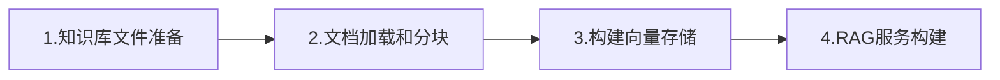
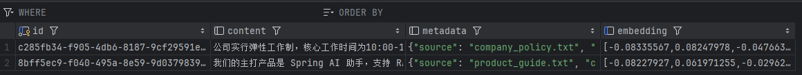
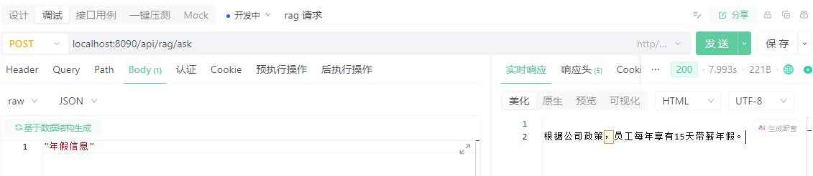

### 1.前置环境准备

#### 1.1 环境要求

- JDK 17+
- **Maven** 或 Gradle（推荐 Spring Boot 3.x）
- 一个可用（含有Embedding嵌入模型额度）的 LLM API（如 OpenAI、Ollama、Azure OpenAI、DeepSeek、通义千问、**智谱**等）
- 向量数据库（如 Chroma、Pinecone、Milvus、**Pgvector**或 Spring AI 内置的 SimpleVectorStore）
- docker 环境（部署向量数据库，可选）

#### 1.2 添加依赖

```xml
    <parent>
        <groupId>org.springframework.boot</groupId>
        <artifactId>spring-boot-starter-parent</artifactId>
        <version>3.2.3</version>
    </parent>

    <properties>
        <maven.compiler.source>17</maven.compiler.source>
        <maven.compiler.target>17</maven.compiler.target>
        <project.build.sourceEncoding>UTF-8</project.build.sourceEncoding>
        <spring-boot.version>3.2.3</spring-boot.version>
        <spring-ai.version>1.0.3</spring-ai.version>
    </properties>

    <dependencyManagement>
        <dependencies>
            <dependency>
                <groupId>org.springframework.ai</groupId>
                <artifactId>spring-ai-bom</artifactId>
                <version>1.0.3</version>
                <type>pom</type>
                <scope>import</scope>
            </dependency>
        </dependencies>
    </dependencyManagement>

    <dependencies>
        <!-- Web 支持 -->
        <dependency>
            <groupId>org.springframework.boot</groupId>
            <artifactId>spring-boot-starter-web</artifactId>
        </dependency>

<!--  向量数据库   -->
        <dependency>
            <groupId>org.springframework.ai</groupId>
            <artifactId>spring-ai-starter-vector-store-pgvector</artifactId>
        </dependency>
<!-- 智谱llm-->
        <dependency>
            <groupId>org.springframework.ai</groupId>
            <artifactId>spring-ai-starter-model-zhipuai</artifactId>
        </dependency>
<!--    postgresql  -->
        <dependency>
            <groupId>org.postgresql</groupId>
            <artifactId>postgresql</artifactId>
        </dependency>
        <dependency>
            <groupId>org.projectlombok</groupId>
            <artifactId>lombok</artifactId>
            <scope>provided</scope>
        </dependency>
        
    </dependencies>


    <repositories>
        <repository>
            <id>spring-snapshots</id>
            <name>Spring Snapshots</name>
            <url>https://repo.spring.io/snapshot</url>
            <releases>
                <enabled>false</enabled>
            </releases>
        </repository>
        <repository>
            <name>Central Portal Snapshots</name>
            <id>central-portal-snapshots</id>
            <url>https://central.sonatype.com/repository/maven-snapshots/</url>
            <releases>
                <enabled>false</enabled>
            </releases>
            <snapshots>
                <enabled>true</enabled>
            </snapshots>
        </repository>
    </repositories>
```

#### 1.3 向量数据库`pgvector`

`docker-compose.yml`

```yml
version: '3.8'

#  docker pull swr.cn-north-4.myhuaweicloud.com/ddn-k8s/docker.io/pgvector/pgvector:pg17-linuxarm64
#  docker tag  swr.cn-north-4.myhuaweicloud.com/ddn-k8s/docker.io/pgvector/pgvector:pg17-linuxarm64  docker.io/pgvector/pgvector:pg17

services:
  pgvector:
    image: pgvector/pgvector:pg17
    container_name: pgvector-db
    restart: unless-stopped
    environment:
      POSTGRES_DB: aidb          # 默认数据库名
      POSTGRES_USER: aidb      # 应用用户（非超级用户）
      POSTGRES_PASSWORD: admin  # 请务必修改！
      POSTGRES_INITDB_ARGS: "--auth-host=scram-sha-256"
    ports:
      - "5432:5432"                  # 映射到宿主机 5432
    volumes:
      - pgvector_data:/var/lib/postgresql/data
      # 可选：挂载自定义初始化脚本
      # - ./init-scripts:/docker-entrypoint-initdb.d
    healthcheck:
      test: ["CMD-SHELL", "pg_isready -U aidb -d aidb"]
      interval: 30s
      timeout: 10s
      retries: 3

volumes:
  pgvector_data:
```

### 2. 流程总览



### 3. 系统构建

#### 3.1 知识文档准备

这里准备两个文本文件（文件内容可以不做限制，方便理解和处理,不同格式文件处理方式也不同）`company_policy.txt`、`product_guide.txt`，放在`resource/documents`下。

```txt
公司实行弹性工作制，核心工作时间为10:00-16:00。
员工每年享有15天带薪年假。
加班需提前申请并获得主管批准。
```

```txt
我们的主打产品是 Spring AI 助手，支持 RAG、Agent 和对话记忆。
支持 OpenAI、Ollama、Azure 等多种模型后端。
```

#### 3.2 项目配置

`application.yml`

```yml
server:
  port: 8090

spring:
  datasource:
    url: jdbc:postgresql://localhost:5432/aidb
    username: aidb
    password: admin
    driver-class-name: org.postgresql.Driver
  ai:
    zhipuai:
      api-key: apikey
#      base-url: https://open.bigmodel.cn/api/paas/v4
      chat:
          options:
              model: glm-4.5-flash
      embedding:
        options:
          model: embedding-3
          dimensions: 1024


    vectorstore:
      pgvector:
        table-name: ai_vector 
        initialize-schema: true
        dimensions: 1024


```

> [!NOTE] 
>
> * 新版`zhipu api`在使用`embedding`可以不用配置`base-url`，否则会出现404
> * 向量数据库数据维度`dimensions`需要和`embedding.model.dimensions`保持一致 ，不一致需要删表重建
> * 注意申请Api需要有对应模型的请求额度
> * docker部署的向量数据库更加便捷，不会出现本地部署或者连接云端数据库缺少扩展的问题

#### 3.3 文件处理

##### 3.3.1 文件加载

```java
Resource resource = new DefaultResourceLoader().getResource("classpath:documents/company_policy.txt");
List<Document> documents = new TextReader(resource).get();
```

##### 3.3.2 文件分块

使用`TokenTextSplitter`分块

```java
var textSplitter = new TokenTextSplitter();
List<Document> chunks = textSplitter.apply(documents);
```

##### 3.3.3 文件向量化存储

调用`Embedding`模型向量化，并进行存储

```java
vectorStore.add(chunks);
```



##### 3.3.4 整体流程

> 这里是设置项目启动处理文件，进行分块和向量化，但这里做了去重处理，防止重复向量化。（第一次启动后续可以注释掉。）

```java
@Component
public class DocumentLoader {

    private static final Logger log = LoggerFactory.getLogger(DocumentLoader.class);
    private final VectorStore vectorStore;

    public DocumentLoader(VectorStore vectorStore) {
        this.vectorStore = vectorStore;
    }

    @EventListener(ApplicationReadyEvent.class)
    public void loadDocuments() throws IOException {

        //1.查询向量库,避免调用请求重复向量化
        List<String> vecStores = queryVecStore();
        //2.加载文档
        PathMatchingResourcePatternResolver resolver = new PathMatchingResourcePatternResolver();
        Resource[] resources = resolver.getResources("classpath:documents/*.txt");
        for (Resource resource : resources) {
            log.info("Loading document: {}", resource.getFilename());
            List<Document> documents = new TextReader(resource).get();

            documents.forEach(doc -> {
                String fileName = (String) doc.getMetadata().get("source");
                System.out.println("✅ 文件: " + fileName);
                System.out.println("📝 内容预览: " + doc.getText().substring(0, Math.min(100, doc.getText().length())));
            });

            String source = (String) documents.get(0).getMetadata().get("source");
            if (vecStores.contains(source)){
                log.info("✅ {}已加载，跳过",source);
                continue;
            }
            //3.将文档分割成小块
            var textSplitter = new TokenTextSplitter();
            List<Document> chunks = textSplitter.apply(documents);
            //4.触发嵌入模型对每个文本块进行向量化
            vectorStore.add(chunks);
            log.info("✅ 已加载 {} 个文档块到向量库", chunks.size());
        }


    }

    private List<String> queryVecStore() {
        List<Document> docs = vectorStore.similaritySearch(SearchRequest.builder().query("demo").topK(100).build());
        List<String> fileNames = new ArrayList<>();
        if (!docs.isEmpty()) {
            docs.forEach(doc -> {
                String fileName = (String) doc.getMetadata().get("source");
                fileNames.add(fileName);
                System.out.println("✅ 已查询到文件: " + fileName);
            });
        }
        return fileNames;
    }


}
```

#### 3.4 构建RAG服务

```java
@Service
@Slf4j
public class RagService {

    private final VectorStore vectorStore;
    private final ChatClient chatClient;

    public RagService(VectorStore vectorStore, ChatClient.Builder chatClientBuilder) {
        this.vectorStore = vectorStore;
        this.chatClient = chatClientBuilder.build();
    }

    public String ask(String question) {

        List<Document> docs = vectorStore.similaritySearch(SearchRequest.builder().query(question).topK(3).build());

        // 👇 打印检索结果（关键！）
        log.info("检索到 {} 个文档", docs.size());
        for (int i = 0; i < docs.size(); i++) {
            log.info("文档 {}: {}", i, docs.get(i).getMetadata().get("source"));
        }

        String context = docs.stream()
                .map(Document::getText)
                .collect(Collectors.joining("\n---\n"));

        String prompt = """
                你是一个公司内部助手，请严格基于以下上下文回答问题。
                如果上下文没有相关信息，请回答：“我不知道”。

                上下文：
                %s

                问题：%s
                """.formatted(context, question);

        return chatClient.prompt(prompt).call().content();
    }
}
```

### 4. 测试

```java
@RestController
@RequestMapping("/api/rag")
public class RagController {

    private final RagService ragService;

    public RagController(RagService ragService) {
        this.ragService = ragService;
    }

    @PostMapping("/ask")
    public String ask(@RequestBody String question) {
        return ragService.ask(question);
    }
}
```

https://docs.apipost.net/docs/detail/54a3c7c42c51000?target_id=a14d362f47105&locale=zh-cn

 
